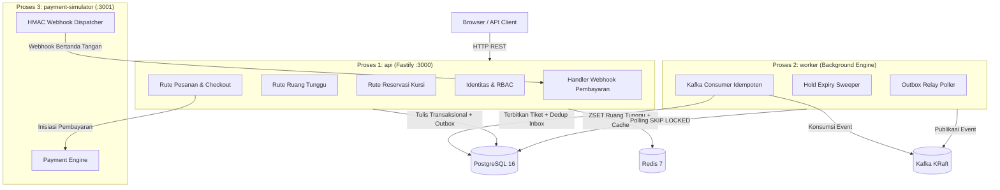
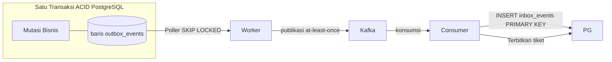
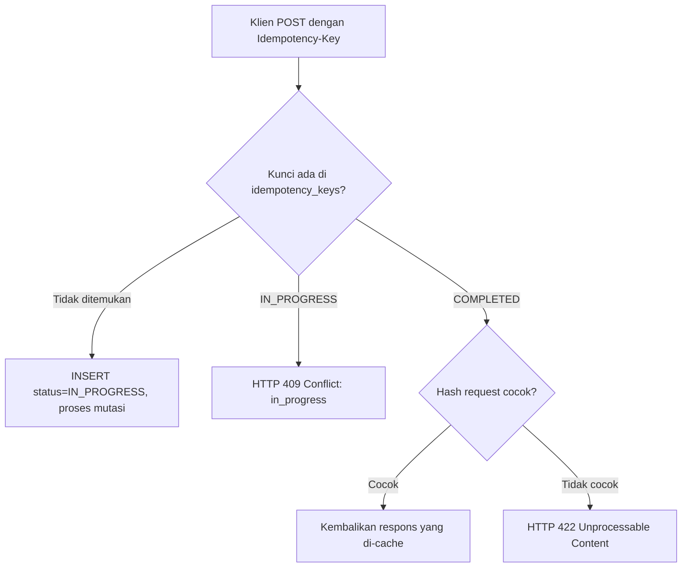

[English](./README.md) | **Bahasa Indonesia**

# Backend Sistem Perebutan Tiket Berkonkurensi Tinggi

Sistem backend tingkat produksi yang direkayasa untuk menangani **serangan thundering herd** pada penjualan tiket konser: ribuan pengguna secara bersamaan memperebutkan kursi bernomor dalam jumlah terbatas. Sistem menjamin **zero overselling**, **zero tiket ganda**, dan **pemrosesan pembayaran exactly-once** di bawah beban konkurensi ekstrem.

> Dibangun untuk membuktikan kemampuan rekayasa backend tingkat principal engineer: desain sistem terdistribusi, pengendalian konkurensi, keandalan berbasis event, chaos engineering, dan observabilitas penuh.

---

## Keunggulan Rekayasa

- **Jaminan Zero Overselling** ditegakkan di lapisan basis data melalui PostgreSQL conditional `UPDATE` dan partial unique index - tanpa mutex pada lapisan aplikasi atau distributed lock.
- **Mitigasi Thundering Herd** menggunakan pertahanan tiga lapis: rate limiting pada lapisan IP, ruang tunggu virtual Redis ZSET dengan kontrol penerimaan Lua atomik, dan row-level locking PostgreSQL.
- **Transactional Outbox Pattern** memastikan event Kafka tidak pernah hilang meskipun broker tidak tersedia saat commit - mutasi bisnis dan penulisan event terjadi dalam satu transaksi ACID PostgreSQL yang sama.
- **Idempotent Consumer** melalui tabel PostgreSQL `inbox_events` dengan primary key komposit `(event_id, consumer_group)` - pengiriman at-least-once dari Kafka tidak dapat menghasilkan tiket ganda.
- **Keamanan Webhook HMAC-SHA256** dengan replay window 300 detik mencegah konfirmasi pembayaran yang dipalsukan dan diputar ulang.
- **IETF Idempotency-Key** (standar draft) pada semua endpoint mutasi: request duplikat bersamaan menerima HTTP 409 Conflict alih-alih diproses ganda.
- **Property-Based Testing** dengan `fast-check` membuktikan kebenaran transisi state machine di semua kemungkinan kombinasi input.
- **Chaos Engineering** dengan Toxiproxy memvalidasi degradasi anggun di bawah kegagalan Redis, injeksi latensi PostgreSQL, dan pemadaman broker Kafka.
- **206 unit test** + integration test via Testcontainers (container PostgreSQL, Redis, Kafka KRaft nyata) + 6 skenario beban k6 hingga 1.000 virtual user bersamaan.

---

## Arsitektur Sistem

Tiga proses runtime independen yang dikompilasi dari satu basis kode modular monolith, berbagi skema domain terpadu:



**Struktur Modul (empat lapisan per modul):**

```
src/
  entrypoints/          # api.ts, worker.ts, payment-simulator.ts
  modules/
    identity/           # domain / application / infrastructure / interface
    catalog/
    waiting-room/
    inventory/
    order/
    payment/
    ticketing/
    notification/
    platform/           # bersama: clock port, UUIDv7, error handler, outbox
```

Isolasi antar-modul ditegakkan ketat oleh `dependency-cruiser`: tidak ada modul yang boleh mengimpor dari lapisan internal modul lain - hanya melalui barrel export publik `index.ts`.

---

## Tantangan Teknis Utama & Solusi

### 1. Thundering Herd - Ruang Tunggu Virtual Redis

Ketika penjualan dibuka, puluhan ribu pengguna menyerbu sistem secara bersamaan. Akses basis data langsung akan menyebabkan connection exhaustion dan cascading failure.

**Solusi: Kontrol penerimaan tiga lapis**

```
Lapis 1 (Perimeter)    Rate limiter Fastify - token bucket per-IP
Lapis 2 (Buffer)       Ruang tunggu Redis ZSET - FIFO berdasarkan timestamp kedatangan
Lapis 3 (Transaksi)    Conditional UPDATE PostgreSQL - satu-satunya sumber kebenaran
```

Ruang tunggu menggunakan skrip Lua atomik untuk mengekstrak posisi pengguna tanpa race condition. Pengguna yang diluluskan menerima token admission JWT berumur pendek (5-10 menit). Middleware reservasi memvalidasi token ini secara lokal tanpa round-trip ke Redis.

```lua
-- Lua atomik: daftarkan pengguna ke ZSET dan kembalikan posisi saat ini
local key = KEYS[1]
local userId = ARGV[1]
local score = tonumber(ARGV[2])
redis.call('ZADD', key, 'NX', score, userId)
return redis.call('ZRANK', key, userId)
```

### 2. Zero Overselling - Conditional UPDATE PostgreSQL

Tanpa application lock, tanpa distributed lock Redis. Engine basis data adalah satu-satunya penentu kepemilikan kursi.

```sql
-- Mode 1: Kursi bernomor spesifik (conditional UPDATE)
UPDATE seats
SET status = 'HELD', held_by = $userId, expires_at = $expiresAt, updated_at = NOW()
WHERE id = $seatId AND status = 'AVAILABLE'
RETURNING id;
-- 0 baris dikembalikan = pengguna lain menang balapan -> HTTP 409 Conflict

-- Mode 2: Alokasi otomatis per kategori (row lock non-blocking)
SELECT id FROM seats
WHERE event_id = $eventId AND category_id = $catId AND status = 'AVAILABLE'
ORDER BY seat_number ASC
LIMIT $quantity
FOR UPDATE SKIP LOCKED;
-- SKIP LOCKED mengeliminasi antrean lock: worker bersamaan langsung ambil batch kursi berikutnya
```

Partial unique index memberikan jaminan keras di tingkat basis data:

```sql
CREATE UNIQUE INDEX idx_seat_holds_single_active
ON seat_holds (seat_id)
WHERE status = 'ACTIVE';
-- Basis data secara fisik menolak dua hold ACTIVE bersamaan untuk kursi yang sama
```

### 3. Transactional Outbox & Idempotent Consumer

Mempublikasikan ke Kafka setelah commit basis data berisiko kehilangan event jika broker tidak tersedia saat itu. Two-phase commit (2PC) tidak digunakan.

**Solusi: Pola outbox dengan deduplication inbox**



- Poller outbox menggunakan `SELECT ... FOR UPDATE SKIP LOCKED` untuk mendistribusikan beban ke beberapa instans worker tanpa contention.
- Tabel inbox memiliki primary key komposit `(event_id, consumer_group)`. Pengiriman ulang Kafka untuk event yang sama menyebabkan pelanggaran primary key yang ditangkap dan diabaikan secara diam-diam - consumer secara alami bersifat idempoten.

### 4. Keamanan Webhook HMAC-SHA256

```
Tanda Tangan = HMAC-SHA256(secret, timestamp + "." + raw_body)
```

Handler webhook memvalidasi:
1. Header `X-Webhook-Signature` cocok dengan HMAC yang dihitung.
2. `X-Webhook-Timestamp` berada dalam window 300 detik dari `Date.now()` - mencegah webhook hasil rekaman lama yang diputar ulang.
3. Raw body dibaca sebelum parsing JSON untuk memastikan verifikasi tanda tangan yang byte-exact.

### 5. IETF Idempotency-Key (Standar Draft)



Request duplikat bersamaan dengan kunci yang sama keduanya memeriksa basis data secara atomik. Yang kalah langsung menerima HTTP 409 tanpa pemrosesan ganda.

---

## Jaminan Konkurensi & Keandalan

Empat invarian basis data diperiksa secara otomatis setelah setiap uji beban dan uji kekacauan (`pnpm run db:check-invariants`):

| Invarian | Query | Hasil yang Diharapkan |
|----------|-------|----------------------|
| Zero Overselling | `SELECT seat_id, COUNT(*) FROM tickets WHERE status='ISSUED' GROUP BY seat_id HAVING COUNT(*) > 1` | 0 baris |
| Zero Orphan Hold | `SELECT id FROM seat_holds WHERE status='ACTIVE' AND expires_at < NOW() - INTERVAL '30 seconds'` | 0 baris |
| Pesanan PAID Punya Tiket | Setiap `orders.status='PAID'` memiliki minimal 1 `tickets.status='ISSUED'` | 0 pelanggaran |
| Keseimbangan Finansial | `SUM(tickets.price)` = `SUM(orders.total_amount)` untuk semua pesanan PAID | 0 selisih |

Satu pelanggaran invarian akan keluar dengan kode 1 dan menggagalkan pipeline CI.

---

## Strategi Pengujian

```
test/
  unit/           Vitest - aturan domain, state machine, pure function
  integration/    Testcontainers - container PostgreSQL, Redis, Kafka KRaft nyata
  concurrency/    1.000 request bersamaan untuk 1 kursi -> tepat 1 pemenang
                  1.000 request bersamaan dengan Idempotency-Key sama -> tepat 1 pesanan
                  100 webhook duplikat bersamaan -> tepat 1 tiket diterbitkan
  e2e/            Simulasi alur penuh: bergabung antrean -> hold -> pesan -> bayar -> tiket
  security/       Pemalsuan HMAC, replay attack, IDOR, penolakan mass assignment
```

**Property-based testing** (`fast-check`): menghasilkan ribuan urutan input acak untuk membuktikan transisi state machine selalu valid dan tidak ada state ilegal yang dapat dicapai.

**Skenario Uji Beban k6:**

| Skenario | Profil Beban | Ambang Batas |
|----------|-------------|--------------|
| A: Baseline Browse | 50 VU, 2 menit | p95 < 50ms, error < 0.1% |
| B: Queue Surge | Lonjakan 1.000 VU | p95 < 100ms, zero dropped connections |
| C: Seat Hold Battle | 500 VU, 100 kursi | Tepat 100 HELD, p95 < 200ms |
| D: End-to-End War | 1.000 VU alur penuh | p95 < 350ms, zero overselling |
| E: Hold Expiry Spike | 200 VU, tanpa bayar | Kursi kembali AVAILABLE tepat waktu |
| F: Webhook Flood | 100 VU webhook campuran | Zero corrupt state, 100% konsisten |

**Skenario Chaos Engineering (Toxiproxy):**

| Skenario | Kesalahan yang Diinjeksi | Perilaku yang Diverifikasi |
|----------|------------------------|---------------------------|
| Chaos 1 | Redis terputus total | API beralih ke local rate limiter, baca PostgreSQL langsung |
| Chaos 2 | Latensi PostgreSQL 500ms + pembatasan koneksi | Graceful HTTP 503, proses tidak crash |
| Chaos 3 | Kafka mati saat checkout | Pesanan tercatat di PostgreSQL, outbox terkirim setelah recovery |
| Chaos 4 | Penundaan webhook hingga 15 menit | Logika kompensasi: re-confirm atau auto-refund, deterministik |

---

## Stack Observabilitas

Stack observabilitas lengkap yang di-provisioning via Docker Compose:

| Komponen | Tujuan |
|----------|--------|
| Prometheus | Pengambilan metrik dari `prom-client` (endpoint `/metrics`) |
| Grafana | 5 dasbor pre-provisioned sebagai kode (JSON) |
| OpenTelemetry | Konteks trace dipropagasikan antar batas proses melalui header Kafka |

**5 Dasbor Grafana:**
1. **Application Health & HTTP Performance** - RPS, error rate, latensi p50/p95/p99
2. **Database Performance & Connection Pool** - Latensi query, lock wait time, utilisasi pool
3. **Kafka Health & Consumer Lag** - Kesehatan broker, topic lag, backlog outbox
4. **Business Metrics** - Laju penjualan tiket, pendapatan (IDR), konversi checkout
5. **Critical User Journey** - Corong end-to-end: antrean -> hold -> bayar -> tiket terbit

---

## Pipeline CI/CD

Workflow GitHub Actions dengan 6 quality gate berurutan (`.github/workflows/ci.yml`):

```
1. TypeScript Strict Typecheck   (tsc --noEmit, strict: true, no implicit any)
2. ESLint Flat Config            (typescript-eslint, no unused vars, no explicit any)
3. Prettier Format Check         (pemformatan konsisten ditegakkan)
4. dependency-cruiser            (no cycles, enkapsulasi modul ketat)
5. Vitest Unit Test Suite        (206 test, termasuk property-based tests)
6. Production Build              (tsc -p tsconfig.build.json, zero emit errors)
```

**Penjaga Arsitektur** (`dependency-cruiser`):
- Tidak ada dependensi sirkular di seluruh codebase.
- Modul hanya boleh mengimpor dari barrel publik `index.js` modul lain - tidak pernah dari path internal `domain/`, `application/`, `infrastructure/`, atau `interface/`.
- Lapisan `domain/` memiliki nol dependensi eksternal (TypeScript murni, tanpa I/O).

---

## Tech Stack

| Lapisan | Teknologi | Alasan |
|---------|-----------|--------|
| HTTP Framework | Fastify v5 | Plugin encapsulation, validasi skema bawaan, throughput tinggi |
| Bahasa | TypeScript 5 (strict) | Zero implicit any, type safety eksplisit di semua batas |
| ORM / Query | Drizzle ORM + node-postgres | SQL type-safe, raw SQL untuk critical section (row locking) |
| Basis Data Utama | PostgreSQL 16 | Transaksi ACID, row-level locking, partial unique index |
| Cache / Antrean | Redis 7 | ZSET untuk ruang tunggu FIFO, skrip Lua atomik |
| Message Broker | Apache Kafka KRaft | At-least-once delivery, manajemen offset consumer group |
| Driver Kafka | @confluentinc/kafka-javascript | Driver resmi Confluent dengan binding librdkafka |
| Hash Password | argon2id | Parameter yang direkomendasikan OWASP (64MB memori, 3 iterasi) |
| Validasi Skema | Zod + fastify-type-provider-zod | Validasi runtime dengan inferensi tipe TypeScript |
| Pengenal | UUIDv7 | Berurutan waktu, efisien index B-tree, bebas tabrakan |
| Metrik | prom-client | Metrik kompatibel Prometheus, counter bisnis kustom |
| Logging Terstruktur | Pino | Log JSON dengan redaksi PII (password, token, authorization) |
| Package Manager | pnpm | Hoisting ketat, dukungan workspace |
| Test Framework | Vitest | Native ESM, eksekusi cepat, kompatibel dengan Testcontainers |
| Integration Test | Testcontainers | Container infrastruktur nyata, tanpa mock pada batas I/O |
| Load Testing | k6 | Skenario berbasis skrip dengan assertion threshold |
| Chaos Testing | Toxiproxy | Injeksi kesalahan jaringan (latensi, disconnect, jitter) |
| Validasi Arsitektur | dependency-cruiser | Tegakkan aturan batas modul di CI |

---

## Quickstart

```bash
# 1. Pasang semua dependensi proyek
pnpm install

# 2. Siapkan variabel lingkungan
cp .env.example .env

# 3. Jalankan infrastruktur lokal (PostgreSQL, Redis, Kafka KRaft)
docker compose --profile core up -d

# 4. Terapkan migrasi basis data dan seed 1.000 kursi bernomor
pnpm run db:migrate && pnpm run db:seed

# 5. Jalankan server API
pnpm run dev:api
```

- Swagger UI OpenAPI: `http://localhost:3000/docs`
- Halaman demo interaktif: `http://localhost:3000/`
- Jalankan proses worker: `pnpm run dev:worker`
- Jalankan simulator pembayaran: `pnpm run dev:simulator`
- Jalankan stack observabilitas penuh: `docker compose --profile observability up -d`

**Target Make:**

```bash
make ci              # Jalankan semua 6 quality gate secara lokal
make test            # Unit test saja
make up-core         # Start container infrastruktur
make check-invariants # Jalankan pemeriksa invarian basis data
```

---

## Peta Repositori

```
ticket-in/
  src/
    entrypoints/        api.ts, worker.ts, payment-simulator.ts
    modules/
      identity/         Auth, RBAC, rotasi refresh token
      catalog/          Manajemen event dan kategori kursi
      waiting-room/     Antrean Redis ZSET, penerimaan Lua, token JWT
      inventory/        Pembacaan ketersediaan kursi, manajemen hold TTL
      order/            Pembuatan pesanan dari hold aktif, idempotensi
      payment/          Checkout, handler webhook HMAC, kompensasi
      ticketing/        Penerbitan tiket digital, consumer idempoten
      notification/     Log notifikasi terstruktur
      platform/         Clock port, UUIDv7, RFC 9457 error handler, outbox
  migrations/           Berkas migrasi SQL terkelola Drizzle Kit
  test/                 unit / integration / concurrency / e2e / security
  loadtest/             Skenario k6 A hingga F
  scripts/              invariant-check.ts, seed.ts, skrip chaos
  observability/        Dasbor Grafana (JSON), konfigurasi Prometheus
  docs/                 Arsitektur, skema DB, rute API, model ancaman
  .github/workflows/    ci.yml - pipeline GitHub Actions 6-gate
  .dependency-cruiser.cjs  Aturan penegakan batas arsitektur
  compose.yaml          Orkestrasi Docker Compose multi-profile
  Makefile              Target otomasi build, test, dan CI
```

---

## Indeks Dokumentasi

| Dokumen | Isi |
|---------|-----|
| [`docs/architecture.md`](./docs/architecture.md) | Topologi tiga proses, diagram urutan, state machine, kebijakan degradasi |
| [`docs/database-schema.md`](./docs/database-schema.md) | Skema PostgreSQL lengkap, konvensi UUIDv7, partial index, tabel outbox/inbox |
| [`docs/api-routes.md`](./docs/api-routes.md) | Semua endpoint REST, header yang wajib, matriks kode status HTTP |
| [`docs/security/threat-model.md`](./docs/security/threat-model.md) | Model ancaman STRIDE, kontrol OWASP ASVS Level 2, mitigasi bot |
| [`docs/cross-platform-guide.md`](./docs/cross-platform-guide.md) | Setup Windows dan Linux, Docker Compose profiles |
| [`docs/PLAN.md`](./docs/PLAN.md) | Dokumen desain engineering penuh: 30-seksi analisis, ADR, semua rencana fase |
