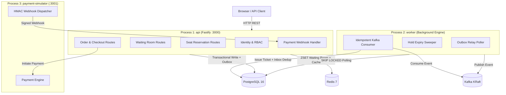
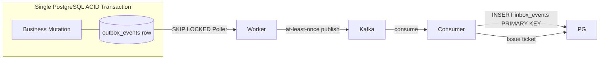
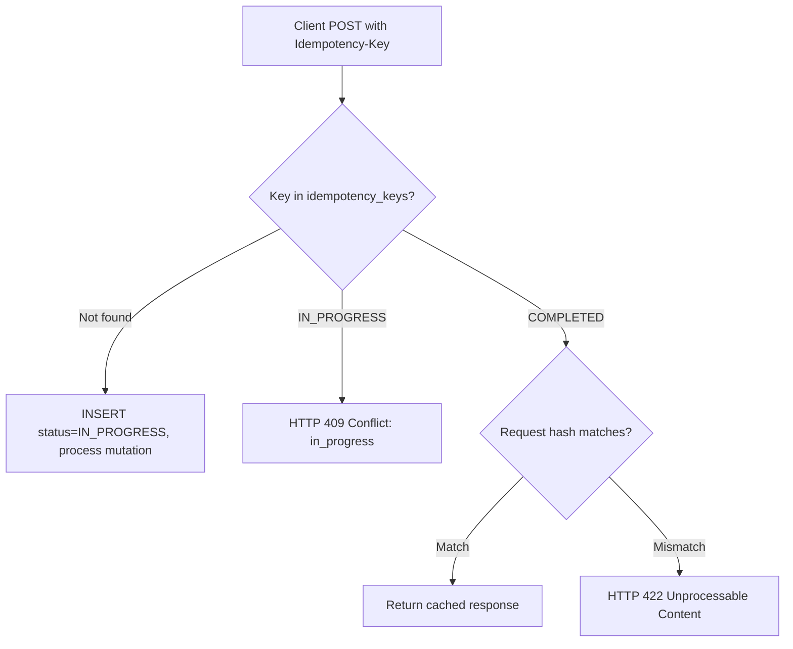

[English](./README.md) | [Bahasa Indonesia](./README.id.md)

# High-Concurrency Ticket War Backend

A production-grade backend system engineered to handle **thundering herd attacks** on a concert ticket sale: thousands of users simultaneously competing for a fixed number of numbered seats. The system guarantees **zero overselling**, **zero duplicate tickets**, and **exactly-once payment processing** under extreme concurrent load.

> Built to demonstrate principal-engineer-level backend engineering: distributed systems design, concurrency control, event-driven reliability, chaos engineering, and full observability.

---

## Engineering Highlights

- **Zero-Overselling Guarantee** enforced at the database layer via PostgreSQL conditional `UPDATE` and a partial unique index - no application-level mutex or distributed lock required.
- **Thundering Herd Mitigation** using a three-layer defense: IP-level rate limiting, a Redis ZSET virtual waiting room with atomic Lua admission control, and PostgreSQL row-level locking.
- **Transactional Outbox Pattern** ensures Kafka events are never lost even if the broker is down at commit time - business mutation and event write happen in a single PostgreSQL ACID transaction.
- **Idempotent Consumer** via a PostgreSQL `inbox_events` table with a composite primary key `(event_id, consumer_group)` - Kafka's at-least-once delivery cannot produce duplicate tickets.
- **HMAC-SHA256 Webhook Security** with a 300-second replay window prevents forged and replayed payment confirmations.
- **IETF Idempotency-Key** (draft standard) on all mutating endpoints: concurrent duplicate requests receive HTTP 409 Conflict instead of double-processing.
- **Property-Based Testing** with `fast-check` proves state machine transition correctness across all possible input combinations.
- **Chaos Engineering** with Toxiproxy validates graceful degradation under Redis failure, PostgreSQL latency injection, and Kafka broker outage.
- **206 unit tests** + integration tests via Testcontainers (real PostgreSQL, Redis, Kafka KRaft containers) + 6 k6 load scenarios up to 1,000 concurrent virtual users.

---

## System Architecture

Three independent runtime processes compiled from a single modular monolith codebase, sharing a unified domain schema:



**Module Structure (four layers per module):**

```
src/
  entrypoints/          # api.ts, worker.ts, payment-simulator.ts
  modules/
    identity/           # domain / application / infrastructure / interface
    catalog/
    waiting-room/
    inventory/
    order/
    payment/
    ticketing/
    notification/
    platform/           # shared: clock port, UUIDv7, error handler, outbox
```

Strict cross-module isolation is enforced by `dependency-cruiser`: no module may import from another module's internal layers - only through its public `index.ts` barrel export.

---

## Core Technical Challenges & Solutions

### 1. Thundering Herd - Redis Virtual Waiting Room

When a sale opens, tens of thousands of users hit the system simultaneously. Direct database access would cause connection exhaustion and cascading failure.

**Solution: Three-layer admission control**

```
Layer 1 (Perimeter)    Fastify rate limiter - per-IP token bucket
Layer 2 (Buffer)       Redis ZSET waiting room - FIFO by arrival timestamp
Layer 3 (Transaction)  PostgreSQL conditional UPDATE - single source of truth
```

The waiting room uses an atomic Lua script to extract user rank without race conditions. Admitted users receive a short-lived JWT admission token (5-10 min). The reservation middleware validates this token locally without a Redis round-trip.

```lua
-- Atomic Lua: register user in ZSET and return current rank
local key = KEYS[1]
local userId = ARGV[1]
local score = tonumber(ARGV[2])
redis.call('ZADD', key, 'NX', score, userId)
return redis.call('ZRANK', key, userId)
```

### 2. Zero-Overselling - PostgreSQL Conditional UPDATE

No application lock, no Redis distributed lock. The database engine is the single arbiter of seat ownership.

```sql
-- Mode 1: Specific numbered seat (conditional UPDATE)
UPDATE seats
SET status = 'HELD', held_by = $userId, expires_at = $expiresAt, updated_at = NOW()
WHERE id = $seatId AND status = 'AVAILABLE'
RETURNING id;
-- 0 rows returned = another user won the race -> HTTP 409 Conflict

-- Mode 2: Auto-allocation per category (non-blocking row lock)
SELECT id FROM seats
WHERE event_id = $eventId AND category_id = $catId AND status = 'AVAILABLE'
ORDER BY seat_number ASC
LIMIT $quantity
FOR UPDATE SKIP LOCKED;
-- SKIP LOCKED eliminates lock queue contention: concurrent workers take the next available batch
```

A partial unique index provides a hard database-level guarantee:

```sql
CREATE UNIQUE INDEX idx_seat_holds_single_active
ON seat_holds (seat_id)
WHERE status = 'ACTIVE';
-- The database physically rejects two simultaneous ACTIVE holds for the same seat
```

### 3. Transactional Outbox & Idempotent Consumer

Publishing to Kafka after a database commit risks losing events if the broker is unavailable at that moment. Two-phase commit (2PC) is not used.

**Solution: Outbox pattern with inbox deduplication**



- The outbox poller uses `SELECT ... FOR UPDATE SKIP LOCKED` to distribute load across multiple worker instances without contention.
- The inbox table has a composite primary key `(event_id, consumer_group)`. Kafka re-delivery of the same event causes a primary key violation that is caught and silently ignored - the consumer is naturally idempotent.

### 4. HMAC-SHA256 Webhook Security

```
Signature = HMAC-SHA256(secret, timestamp + "." + raw_body)
```

The webhook handler validates:
1. `X-Webhook-Signature` header matches the computed HMAC.
2. `X-Webhook-Timestamp` is within a 300-second window of `Date.now()` - prevents replayed captured webhooks.
3. Raw body is read before JSON parsing to ensure byte-exact signature verification.

### 5. IETF Idempotency-Key (Draft Standard)



Concurrent duplicate requests for the same key both check the database atomically. The loser receives HTTP 409 immediately without double-processing.

---

## Concurrency & Reliability Guarantees

Four database invariants are checked automatically after every load test and chaos test run (`pnpm run db:check-invariants`):

| Invariant | Query | Expected Result |
|-----------|-------|-----------------|
| Zero Overselling | `SELECT seat_id, COUNT(*) FROM tickets WHERE status='ISSUED' GROUP BY seat_id HAVING COUNT(*) > 1` | 0 rows |
| Zero Orphan Hold | `SELECT id FROM seat_holds WHERE status='ACTIVE' AND expires_at < NOW() - INTERVAL '30 seconds'` | 0 rows |
| Paid Orders Have Tickets | Every `orders.status='PAID'` has at least 1 `tickets.status='ISSUED'` | 0 violations |
| Financial Balance | `SUM(tickets.price)` = `SUM(orders.total_amount)` for all PAID orders | 0 discrepancy |

Any violation exits with code 1 and fails the CI pipeline.

---

## Testing Strategy

```
test/
  unit/           Vitest - domain rules, state machines, pure functions
  integration/    Testcontainers - real PostgreSQL, Redis, Kafka KRaft containers
  concurrency/    1,000 simultaneous requests for 1 seat -> exactly 1 winner
                  1,000 simultaneous requests with same Idempotency-Key -> exactly 1 order
                  100 simultaneous duplicate webhooks -> exactly 1 ticket issued
  e2e/            Full flow simulation: queue join -> hold -> order -> pay -> ticket
  security/       HMAC forgery, replay attack, IDOR, mass assignment rejection
```

**Property-based testing** (`fast-check`): generates thousands of random input sequences to prove state machine transitions are always valid and no illegal state is reachable.

**k6 Load Test Scenarios:**

| Scenario | Load Profile | Threshold |
|----------|-------------|-----------|
| A: Baseline Browse | 50 VU, 2 min | p95 < 50ms, error < 0.1% |
| B: Queue Surge | 1,000 VU spike | p95 < 100ms, zero dropped connections |
| C: Seat Hold Battle | 500 VU, 100 seats | Exactly 100 HELD, p95 < 200ms |
| D: End-to-End War | 1,000 VU full flow | p95 < 350ms, zero overselling |
| E: Hold Expiry Spike | 200 VU, no payment | Seats return AVAILABLE on time |
| F: Webhook Flood | 100 VU mixed webhooks | Zero corrupt state, 100% consistent |

**Chaos Engineering Scenarios (Toxiproxy):**

| Scenario | Fault Injected | Verified Behavior |
|----------|---------------|-------------------|
| Chaos 1 | Redis total disconnect | API falls back to local rate limiter, reads PostgreSQL directly |
| Chaos 2 | PostgreSQL latency 500ms + connection choke | Graceful HTTP 503, no process crash |
| Chaos 3 | Kafka broker killed during checkout | Orders committed in PostgreSQL, outbox delivered after recovery |
| Chaos 4 | Webhook delay up to 15 minutes | Compensation logic: re-confirm or auto-refund, deterministic |

---

## Observability Stack

Full observability stack provisioned via Docker Compose:

| Component | Purpose |
|-----------|---------|
| Prometheus | Metric scraping from `prom-client` (`/metrics` endpoint) |
| Grafana | 5 pre-provisioned dashboards as code (JSON) |
| OpenTelemetry | Trace context propagated across process boundaries via Kafka headers |

**5 Grafana Dashboards:**
1. **Application Health & HTTP Performance** - RPS, error rate, p50/p95/p99 latency
2. **Database Performance & Connection Pool** - Query latency, lock wait time, pool utilization
3. **Kafka Health & Consumer Lag** - Broker health, topic lag, outbox backlog
4. **Business Metrics** - Ticket sales rate, revenue (IDR), checkout conversion
5. **Critical User Journey** - End-to-end funnel: queue -> hold -> pay -> ticket issued

---

## CI/CD Pipeline

GitHub Actions workflow with 6 sequential quality gates (`.github/workflows/ci.yml`):

```
1. TypeScript Strict Typecheck   (tsc --noEmit, strict: true, no implicit any)
2. ESLint Flat Config            (typescript-eslint, no unused vars, no explicit any)
3. Prettier Format Check         (consistent formatting enforced)
4. dependency-cruiser            (no cycles, strict module encapsulation)
5. Vitest Unit Test Suite        (206 tests, property-based tests included)
6. Production Build              (tsc -p tsconfig.build.json, zero emit errors)
```

**Architectural Guardrails** (`dependency-cruiser`):
- No circular dependencies across the entire codebase.
- Modules may only import from another module's public `index.js` barrel - never from internal `domain/`, `application/`, `infrastructure/`, or `interface/` paths.
- The `domain/` layer has zero external dependencies (pure TypeScript, no I/O).

---

## Tech Stack

| Layer | Technology | Rationale |
|-------|-----------|-----------|
| HTTP Framework | Fastify v5 | Plugin encapsulation, built-in schema validation, high throughput |
| Language | TypeScript 5 (strict) | Zero implicit any, explicit type safety at all boundaries |
| ORM / Query | Drizzle ORM + node-postgres | Type-safe SQL, raw SQL for critical sections (row locking) |
| Primary Database | PostgreSQL 16 | ACID transactions, row-level locking, partial unique indexes |
| Cache / Queue | Redis 7 | ZSET for FIFO waiting room, Lua atomic scripts |
| Message Broker | Apache Kafka KRaft | At-least-once delivery, consumer group offset management |
| Kafka Driver | @confluentinc/kafka-javascript | Official Confluent driver with librdkafka bindings |
| Password Hashing | argon2id | OWASP-recommended parameters (64MB memory, 3 iterations) |
| Schema Validation | Zod + fastify-type-provider-zod | Runtime validation with TypeScript type inference |
| Identifier | UUIDv7 | Time-ordered, B-tree index efficient, collision-free |
| Metrics | prom-client | Prometheus-compatible metrics, custom business counters |
| Structured Logging | Pino | JSON logs with PII redaction (password, token, authorization) |
| Package Manager | pnpm | Strict hoisting, workspace support |
| Test Framework | Vitest | Native ESM, fast execution, compatible with Testcontainers |
| Integration Tests | Testcontainers | Real infrastructure containers, no mocking of I/O boundaries |
| Load Testing | k6 | Scripted scenarios with threshold assertions |
| Chaos Testing | Toxiproxy | Network fault injection (latency, disconnect, jitter) |
| Arch Validation | dependency-cruiser | Enforce module boundary rules in CI |

---

## Quick Start

```bash
# 1. Install all project dependencies
pnpm install

# 2. Set up environment variables
cp .env.example .env

# 3. Start local infrastructure (PostgreSQL, Redis, Kafka KRaft)
docker compose --profile core up -d

# 4. Apply database migrations and seed 1,000 numbered seats
pnpm run db:migrate && pnpm run db:seed

# 5. Start the API server
pnpm run dev:api
```

- OpenAPI Swagger UI: `http://localhost:3000/docs`
- Interactive demo page: `http://localhost:3000/`
- Start worker process: `pnpm run dev:worker`
- Start payment simulator: `pnpm run dev:simulator`
- Run full observability stack: `docker compose --profile observability up -d`

**Make targets:**

```bash
make ci              # Run all 6 quality gates locally
make test            # Unit tests only
make up-core         # Start infrastructure containers
make check-invariants # Run database invariant checker
```

---

## Repository Map

```
ticket-in/
  src/
    entrypoints/        api.ts, worker.ts, payment-simulator.ts
    modules/
      identity/         Auth, RBAC, refresh token rotation
      catalog/          Event and seat category management
      waiting-room/     Redis ZSET queue, Lua admission, JWT token
      inventory/        Seat availability reads, hold TTL management
      order/            Order creation from active hold, idempotency
      payment/          Checkout, HMAC webhook handler, compensation
      ticketing/        Digital ticket issuance, idempotent consumer
      notification/     Structured notification log
      platform/         Clock port, UUIDv7, RFC 9457 error handler, outbox
  migrations/           Drizzle Kit managed SQL migration files
  test/                 unit / integration / concurrency / e2e / security
  loadtest/             k6 scenarios A through F
  scripts/              invariant-check.ts, seed.ts, chaos scripts
  observability/        Grafana dashboards (JSON), Prometheus config
  docs/                 Architecture, DB schema, API routes, threat model
  .github/workflows/    ci.yml - 6-gate GitHub Actions pipeline
  .dependency-cruiser.cjs  Architectural boundary enforcement rules
  compose.yaml          Multi-profile Docker Compose orchestration
  Makefile              Build, test, and CI automation targets
```

---

## Documentation Index

| Document | Contents |
|----------|----------|
| [`docs/architecture.md`](./docs/architecture.md) | Three-process topology, sequence diagrams, state machines, degradation policy |
| [`docs/database-schema.md`](./docs/database-schema.md) | Full PostgreSQL schema, UUIDv7 convention, partial indexes, outbox/inbox tables |
| [`docs/api-routes.md`](./docs/api-routes.md) | All REST endpoints, required headers, HTTP status code matrix |
| [`docs/security/threat-model.md`](./docs/security/threat-model.md) | STRIDE threat model, OWASP ASVS Level 2 controls, bot mitigation |
| [`docs/cross-platform-guide.md`](./docs/cross-platform-guide.md) | Windows and Linux setup, Docker Compose profiles |
| [`docs/PLAN.md`](./docs/PLAN.md) | Full engineering design document: 30-section analysis, ADRs, all phase plans |
